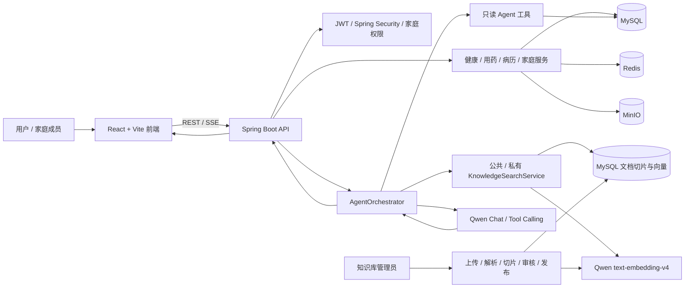

# 康伴智能医疗助手

康伴是一个前后端分离的家庭健康管理系统，也是一个面向医疗场景的 Agent Demo。系统围绕“当前患者”组织健康数据、家庭权限和 AI 问诊，通过自研 Agent 编排层连接只读业务工具、公共 RAG 知识库和 Qwen 模型。

> 健康数据和 AI 输出仅用于功能演示与健康信息参考，不替代医生诊断、处方或急救建议。

## 项目定位

本项目不是简单的聊天页面，而是一条可运行的 Agent 链路：

1. 用户选择本人或授权家庭成员作为当前患者；
2. Agent 根据问题检索患者健康数据、用药和病历摘要；
3. 对公共健康资料执行 RAG 检索，并保留文档、页码或章节引用；
4. 编排工具结果和对话历史，调用 Qwen 生成回答；
5. 通过 SSE 将思考状态、工具轨迹、引用和最终答案返回前端；
6. 对无依据内容、越权数据和写操作执行安全拦截。

当前 Agent 编排为项目内自研实现，未依赖 LangChain4j 或 Spring AI。核心实现位于 [`kangban-server/src/main/java/com/kangban/agent`](kangban-server/src/main/java/com/kangban/agent)。

## 架构概览

完整架构图见 [`docs/agent-architecture.md`](docs/agent-architecture.md)。



## 主要功能

- 登录、注册、图片人机验证、JWT 刷新和管理员协助找回密码；
- 首页、健康指标录入、健康趋势和健康报告；
- 家庭成员管理、家庭授权、成员切换和数据隔离；
- 用药计划、服药记录和药物相互作用提示；
- 病历上传、病历详情、分享和 PDF 下载；OCR 入口保留，真实 OCR 服务未纳入本版本；
- AI 问诊：患者切换、数据库健康概况、只读工具调用、多轮会话和 SSE；
- 公共 RAG：TXT / Markdown / 文本型 PDF 上传、解析、切片、Embedding、审核、发布、检索和引用；
- 私有病历知识索引：按用户、患者和家庭权限过滤；
- 指标、工具轨迹、引用和关键失败状态的可观测性；
- Flyway 数据库迁移、前后端测试和 ECS/Nginx 部署文件。

扫描版 PDF OCR 暂未纳入本版本，文本型 PDF 可以入库。

## 技术栈

### 前端

- React 19
- Vite 8
- Lucide React
- REST API + EventSource/SSE

### 后端

- Java 17
- Spring Boot 3.5
- Spring Security + JWT
- MyBatis-Plus
- MySQL + Flyway
- Redis
- MinIO
- SpringDoc OpenAPI
- Apache PDFBox
- Qwen OpenAI-compatible API

## 目录结构

```text
.
├── kangban-web/                    # React + Vite 前端
├── kangban-server/                 # Spring Boot 后端
│   └── src/main/java/com/kangban/
│       ├── agent/                  # Agent 编排、工具、记忆、安全、指标
│       ├── client/                 # Qwen / AI 客户端
│       ├── controller/             # REST / SSE 接口
│       ├── rag/                    # 文档入库、Embedding、JDBC 检索
│       └── service/                # 领域服务
├── deploy/ecs/                     # ECS、Nginx、Redis、MinIO 部署模板
├── docs/                           # 架构、评测、发布和安全说明
├── scripts/                        # 发布检查和真实 RAG 评测脚本
└── rag-test.md                     # 手工 RAG 验收步骤
```

## 本地运行

### 环境要求

- Node.js 20.19+ 或 22.12+
- npm
- JDK 17+
- Maven 3.9+
- MySQL
- Redis
- MinIO

### 配置

后端示例配置：[`kangban-server/.env.example`](kangban-server/.env.example)

生产示例配置：[`deploy/ecs/app.env.example`](deploy/ecs/app.env.example)

前端示例配置：[`kangban-web/.env.example`](kangban-web/.env.example)

不要提交 `.env`、真实数据库密码、JWT 密钥、MinIO 密钥、管理令牌或 AI API Key。已经暴露过的密钥应立即轮换。

Qwen RAG 相关配置示例：

```text
APP_AI_PROVIDER=qwen
APP_AI_API_URL=https://dashscope.aliyuncs.com/compatible-mode/v1/chat/completions
APP_AI_API_KEY=YOUR_QWEN_API_KEY
APP_AI_AI_MODEL=qwen-plus
APP_RAG_ENABLED=true
APP_RAG_EMBEDDING_PROVIDER=qwen
APP_RAG_EMBEDDING_API_URL=https://dashscope.aliyuncs.com/compatible-mode/v1/embeddings
APP_RAG_EMBEDDING_MODEL=text-embedding-v4
APP_RAG_EMBEDDING_DIMENSIONS=1024
```

### 启动后端

```bash
cd kangban-server
mvn spring-boot:run
```

默认地址：

```text
API：http://127.0.0.1:8080
健康检查：http://127.0.0.1:8080/actuator/health
Swagger：http://127.0.0.1:8080/swagger-ui/index.html
```

### 启动前端

```bash
cd kangban-web
npm ci
npm run dev
```

默认地址：[http://127.0.0.1:5173](http://127.0.0.1:5173)

开发服务器绑定 `0.0.0.0`，可以同时通过 `localhost` 和 `127.0.0.1` 访问。

## 测试与构建

前端：

```bash
cd kangban-web
npm test
npm run build
```

后端：

```bash
cd kangban-server
mvn test -Dspring.profiles.active=test
mvn package
```

RAG 评测命令和指标口径见 [`docs/agent-metrics-guide.md`](docs/agent-metrics-guide.md)。

## RAG 真实指标

项目提供三种评测层级：

1. **离线评测**：固定数据和本地 Embedding，验证评测器、排序、引用和拒答逻辑；
2. **JDBC 评测**：使用测试数据库验证真实 SQL、权限过滤和引用组装；
3. **真实 Qwen 评测**：实际调用 Qwen Embedding，验证文件解析、切片、入库和检索。

真实指标必须来自成功执行的 `scripts/run-live-rag-evaluation.sh`，不能用离线测试数字替代。已有测量记录见 [`docs/rag-metrics-report.md`](docs/rag-metrics-report.md)，每次换网络、模型或资料后都应重新测量。

## 安全边界

- Agent 工具当前只允许注册只读工具；写操作必须走业务接口和用户确认；
- 当前患者、用户、家庭和文档权限由服务端身份推导，不能信任客户端传入的用户 ID；
- 公共资料和家庭私有病历分开检索；
- RAG 无证据时明确拒答，不静默切换到无依据答案；
- 日志不记录完整病历、问题正文、向量和密钥；
- 生产环境应关闭 Swagger、启用 HTTPS、限制 CORS、轮换密钥并配置备份与监控。

## 简历项目表述

> 基于 Spring Boot 自研 Agent Orchestrator 构建家庭医疗智能问诊系统：集成 Qwen Tool Calling、患者健康数据只读工具、MySQL JDBC RAG、结构化引用和 SSE 流式输出；实现家庭成员权限隔离、无依据拒答、医疗写操作确认和 RAG 黄金集评测。

## 相关文档

- [`docs/agent-architecture.md`](docs/agent-architecture.md)：系统架构、请求时序和模块职责
- [`docs/agent-metrics-guide.md`](docs/agent-metrics-guide.md)：3–5 个真实指标的获取方法
- [`docs/rag-golden-evaluation.md`](docs/rag-golden-evaluation.md)：黄金集和离线/JDBC 评测
- [`docs/rag-metrics-report.md`](docs/rag-metrics-report.md)：当前真实 Qwen 评测记录
- [`docs/agent-medical-safety.md`](docs/agent-medical-safety.md)：医疗安全边界
- [`docs/agent-observability.md`](docs/agent-observability.md)：Agent 指标和日志规范
- [`docs/RELEASE_CANDIDATE.md`](docs/RELEASE_CANDIDATE.md)：发布检查和回滚说明
- [`rag-test.md`](rag-test.md)：手工 RAG 验收步骤
