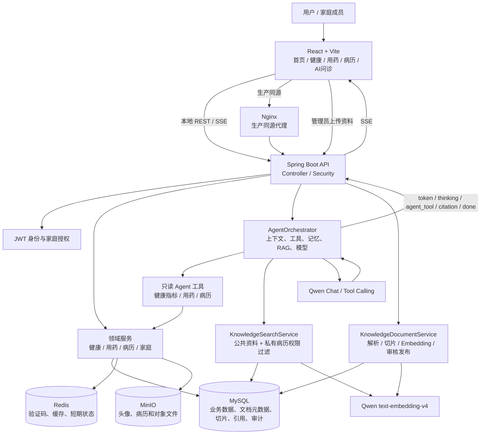
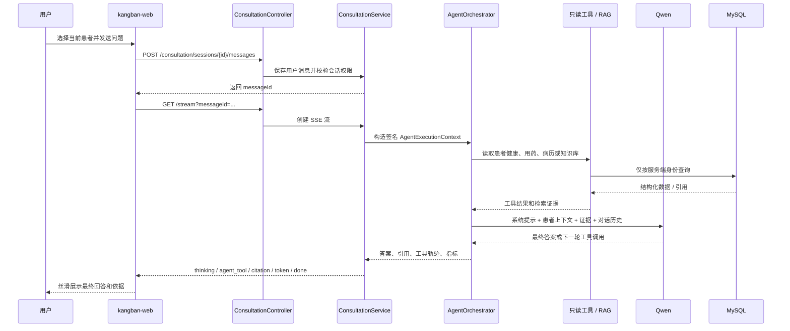

# 康伴医疗 Agent 架构图

## 总体架构

## AI 问诊请求时序

## 关键模块职责

| 模块 | 职责 | 关键边界 |
| --- | --- | --- |
| `AgentOrchestrator` | 管理 Agent 运行、上下文、工具循环、RAG 合并和最终生成 | 不直接写业务表 |
| `AgentExecutionContext` | 携带用户、患者、成员、家庭和运行 ID | 由服务端签名，不能信任客户端身份字段 |
| `AgentToolRegistry` | 注册当前允许使用的工具 | 当前只允许只读工具 |
| `AgentToolExecutor` | 校验上下文、执行工具、记录状态和耗时 | 越权或写工具直接阻断 |
| `KnowledgeDocumentService` | 文档上传、解析、切片、审核、发布和重建索引 | 只有发布且有切片的文档可被公共检索 |
| `JdbcKnowledgeSearchService` | 过滤已发布文档、生成 Query Embedding、混合排序和引用 | 先做文档状态与 Embedding 模型过滤 |
| `ConsultationService` | 保存会话消息并把 Agent 事件转为 SSE | 处理超时、重试和断线收尾 |
| `QwenAiConsultationClient` | Qwen Chat / Tool Calling 适配 | API Key 只从环境变量读取 |

## 数据隔离

- 公共知识库只返回 `PUBLISHED` 且未删除的文档；
- 私有病历检索同时限制 owner、subject、family 和 member 范围；
- Agent 上下文由认证用户和服务端当前患者选择共同生成；
- 前端传入的用户 ID 不能覆盖服务端身份；
- 医疗写操作不由 Agent 工具直接执行，需要用户确认后进入领域接口。

## 故障策略

- Qwen Chat 超时：SSE 返回可重试错误，并保留会话状态；
- Qwen Embedding 不可用：RAG 返回 503，不静默切换为无依据医疗回答；
- 无检索证据：Agent 明确说明资料不足，并建议咨询专业人员；
- 工具异常：记录安全的错误类型和指标，不把病历正文写入日志；
- SSE 断线：服务端收尾，前端可以基于已保存的 messageId 重试。
